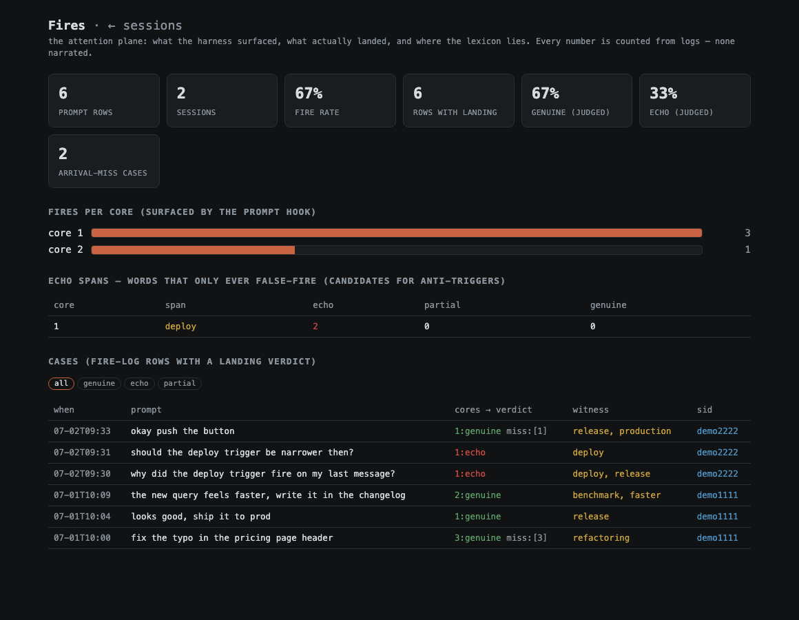

<div align="center">

# reticular

**A hook-level attention layer for LLM agents — built from your own session logs.**

*The reticular activating system is the brain stem's salience filter: it decides
which signals wake the cortex. This is that, for an agent: a few dozen injected tokens
at exactly the turn they matter.*


&nbsp;
&nbsp;

</div>

---

Not transformer attention — no weights are touched. This is attention at the
**context boundary**: a `UserPromptSubmit` hook watches every prompt for your
own native trigger words and, on a hit, injects a tiny reminder pointing at a
**core** — a one-file description of *how you think about exactly this kind of
situation* and the known ways it goes wrong. The model reads it in the moment,
not at position 40,000 of a stale system prompt.

Two things follow from putting the layer at the hook:

- **Drift is visible on turn one.** You set a task; if the agent is looking the
  wrong way, the relevant core fires *now* — not five messages later, after
  legacy has been built on the oversight.
- **It solves lost-in-the-middle by recency**, the one position LLMs reliably
  attend to. The injection is ~50 tokens per fired core; your context budget
  doesn't notice.

The cores are **not shipped — they are grown**. A one-pass installer reads your
Claude Code session logs, emerges the facets of how *you* work (with verbatim
anchors from your own prose), builds the lexicon matrix, wires four hooks, and
then verifies itself against held-out prompts.

Under the hood it is a **reliability ladder**, each layer earning its place by
measurement, not taste:

1. **Floor** — the disposition rulebook (a few thousand tokens, under 1% of a
   modern context window) injected at session start as *bodies, not
   directives*. Deterministic: always there, never a retrieval roll.
2. **Lexicon** — your native trigger words over the prompt. The word is
   either there or it isn't; this layer carries the system.
3. **Dense backstop** — embeddings, fragile by measurement, paying only where
   the words are absent.
4. **LLM judge** — expensive, the only layer that reads meaning; used for
   verdicts, never for counting.

The facets themselves are mostly an **activation layer over a substrate you
already own**: months of corrections, post-mortems and feedback notes that
normally sleep in a memory index and are used by nothing. The harness doesn't
write a new rulebook — it wakes the right page of the old one at the right
turn. Which is also why the layout matters: in an [agent-atlas](https://github.com/zzallirog/agent-atlas)-style
vault, *moving projects around breaks nothing* — files are modules, positions
are free — but every rename toward how you actually speak feeds the index the
matrix latches onto. Reorganizing your memory is not housekeeping here; it is
tuning the attention layer.

## The pair: act + reflect

`reticular` is two planes over the same logs:

| plane | what | when |
|---|---|---|
| **harness** (`harness/`) | 4 hooks: floor (session start), attest (prompt → core fires), act (tool-call parser: edit-without-read, error loops, substrate writes), land (what actually landed in the reply) | live, in the moment |
| **Reflect** (`reflect/`, `localhost:8899`) | sessions dashboard + **Fires plane**: every fire counted, judged genuine/echo, false-fire spans traced to the exact word | retrospective |

Reflect is not a stats page — it is the **representation of the agent's
attention**: what it worked with, in what register (a fast blast of edits vs a
deep audit session — different genres want different things surfaced), and a
session-level attention funnel for auditing: prompt → what fired → what
actually landed → what the judge said. The same funnel is the substrate for
future analytics; today it answers one question honestly: *was the waking
real?*



*The Fires plane on the synthetic demo corpus: fire-rate, per-core counts, an
anti-trigger candidate (`deploy` — two echo hits, zero genuine), and every case
with its judge verdict. Click a verdict chip to filter; every number is counted
from logs, none narrated by a model.*

## Quick start

```sh
# demo — synthetic corpus, no logs needed
# needs Python >= 3.10 (the hooks are stdlib; the server wants fastapi+uvicorn)
git clone https://github.com/zzallirog/reticular && cd reticular
pip install -r requirements.txt
sh demo/run.sh          # → http://127.0.0.1:8899/fires

# the real thing — from YOUR logs (run after Claude Code has some history)
cd harness
sh bootstrap.sh          # phase A: deps + slim-extract of your sessions
# in Claude Code: "run workflow/install.workflow.js"
#   Sonnet: corpus overview + pattern legs → Opus: full sweep, emerge, matrix build
#   → verify: held-out prompts through the LIVE hook + fire-log counter + leak audit
# restart Claude Code; then:
cd ../reflect && python3 server.py       # → sessions + fires over your data
```

An agent installing this for its owner should start at
[`harness/docs/INSTALL-AGENT.md`](harness/docs/INSTALL-AGENT.md).

## What the layer caught (measured, author's corpus)

Twelve days of live fire-log, 112 sessions, 692 substantive turns:

| number | what it says |
|---|---|
| 227 / 692 turns fired (33%) | the lexicon leg carries the layer; dense backstop pays only on misses |
| 286 action-side fires | the tool-call parser: 146 edit-without-read, 115 substrate-write checks, 24 wrong-shell-idiom, 1 error-loop break |
| 651 judged verdicts: **32% genuine · 17% partial · 51% echo** | the honest number that forced the tune loop |
| 76 lexicon-hole candidates, 26 anti-trigger candidates | mined mechanically from the same log — tuning is data, not vibes |

The 51% echo is not a bug to hide — it is *why the loop exists*: a lexicon
that scans replies is biased by its own words (meta-talk about the harness
lights the harness). The judge layer separates word-as-topic from
word-as-act, and the false-fire spans become anti-triggers. Disposition-class
cores are *supposed* to apply almost every turn — they live in the session-start
floor, not in the matrix, precisely so they can't pollute these numbers. And
because "fix the 51%" is exactly the kind of helpful suggestion that would
kill the layer, the tune loop has a **gatekeeper**
(`harness/tools/rebalance_check.py`): no lexicon surgery until the number is
decomposed by core class and the proportions are checked against a saved
baseline.

Seven cases from live use, retold on the demo corpus: [docs/CASES.md](docs/CASES.md).
The full origin story, traced from the vault: [docs/STORY.md](docs/STORY.md).
More screenshots: [docs/GALLERY.md](docs/GALLERY.md).

## How it works (one screen)

```
your logs ──slim──▶ pattern legs (Sonnet ×2) ──▶ emerge (Opus) ──▶ cores/ + lexicon matrix
                                                                        │
prompt ──▶ [attest hook] ── lexical leg + grammar direction axis ──▶ ~50-token core pointer
reply  ──▶ [land hook]  ── same lexicon over the reply ──▶ fire-log.acted_on + witness spans
tools  ──▶ [act hook]   ── deterministic parser over tool-calls ──▶ mode notes (advisory)
start  ──▶ [floor hook] ── disposition cores injected as bodies, not directives
                                                                        │
fire-log ──compile──▶ case-book ──LLM judge──▶ genuine/echo/partial ──▶ tune:
                                        holes → new triggers · echo spans → anti-triggers
                                        (a human applies both; the loop is never closed)
```

Design rules the repo holds to:

- **Source over proxy.** Cores about the user anchor to their verbatim prose;
  cores about the model anchor to its tool-calls. Introspection is never a source.
- **Numbers are counted, never narrated.** Reflect's prose describes shape;
  every figure on screen comes from a log walk with provenance.
- **The tune recursion stays open.** The lexicon proposes; a human commits.
  An auto-tuned lexicon feeding its own oracle converges on noise.

## Family

- [agent-atlas](https://github.com/zzallirog/agent-atlas) — the working-memory
  *layout* this layer assumes: modular context, one concern per file. Names must
  lexically carry their direction — that's what the matrix latches onto.
- [memory-atlas](https://github.com/zzallirog/memory-atlas) — the vault as one
  interactive graph; what reticular's memory side looks like from above.

<details>
<summary><b>Honest scope</b> — where the edges are</summary>

- All headline numbers come from one corpus (the author's, n=1, 12 days).
  The method is the claim: the installer verifies against *your* held-out
  prompts and prints *your* numbers. If the signal isn't there, you get an
  honest zero.
- The matrix is **subjective by construction** — it encodes how *you* frame
  situations, folded from your dispositions and your lexicon. It is not an
  objective classifier and does not pretend to be one; the same word may
  rightly mean different things in different vaults. That's the feature.
- Repeated fires decay (anti-wallpaper): a core pointed several turns in a
  row is suppressed until it rests. This trades a small miss risk for not
  becoming background noise the model learns to ignore.
- The judge is an LLM, not human labels; `anno_src` travels with every verdict
  so downstream analysis can tell them apart.
- The direction axis (act/read grammar) ships with RU+EN carriers; other
  languages need a carrier lexicon (the axis itself is language-invariant).
- Reflect's narrator (optional prose over the dashboards) needs a local
  ollama model or a Claude CLI subscription (one pass:
  `python3 reflect/bin/bake.py`); without either you get numbers and
  template prose — nothing breaks.
- Hooks are Claude Code hook-API shaped. The layer's ideas port to any
  harness with prompt/tool/stop hooks; the code here doesn't try to.

</details>

<details>
<summary><b>Layout of this repo</b></summary>

```
harness/            the buildable layer: bootstrap.sh, 4 hooks, emerge workflows,
                    casebook tools, TUNE.md (false-fire tracing), INSTALL-AGENT.md
reflect/            FastAPI server + engine: sessions plane (/) and fires plane (/fires)
demo/               synthetic corpus generator + run.sh (no real logs needed)
docs/CASES.md       seven live-caught cases, retold on the demo corpus
docs/STORY.md       the origin narrative, traced from the vault
docs/GALLERY.md     screenshots with commentary
docs/shots/         raw screenshots
```

</details>

## License

MIT.
