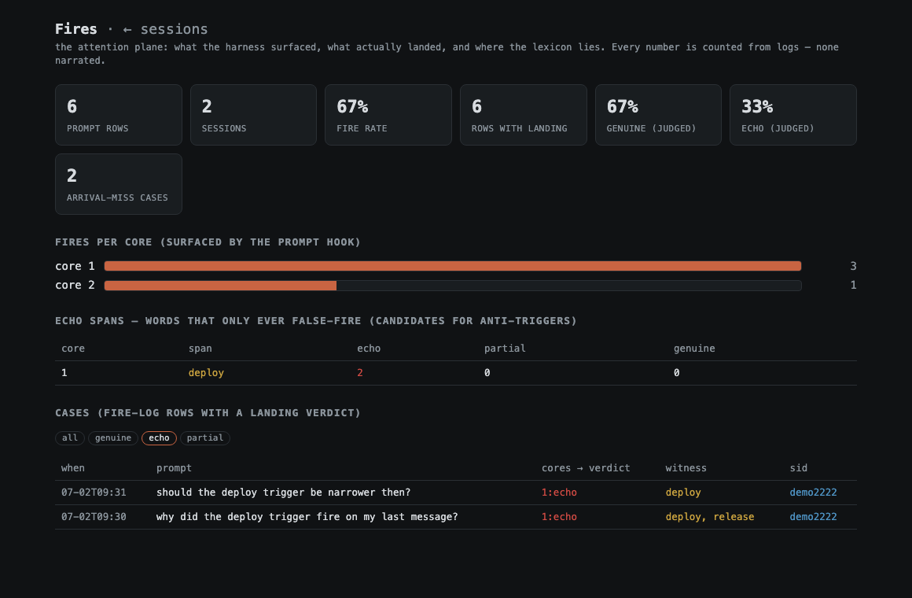
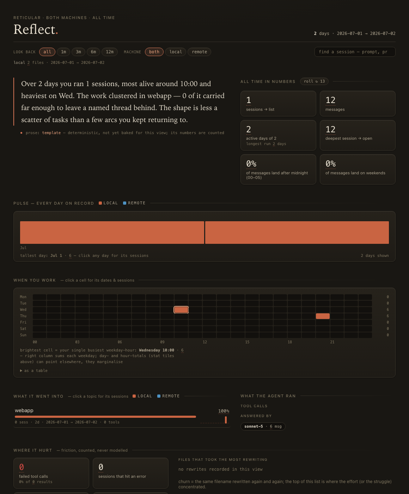

# Gallery

All shots are taken over the **synthetic demo corpus** (`sh demo/run.sh`) —
regenerate them yourself; nothing here comes from a real vault.

## The Fires plane — attention, counted

The whole attention story on one screen: fire-rate over substantive turns,
per-core fire counts, the anti-trigger table (spans that only ever
false-fire), and every case with its judge verdict. `miss:[N]` marks
arrival-misses — turns where a core genuinely landed in the reply but the
prompt lexicon never saw it coming: each one is a lexicon-hole candidate.

## Tracing a false fire to the exact word

Filters deep-link (`/fires?verdict=echo`). Two turns *about* the deploy
trigger lit the deploy core — word-as-topic, not word-as-act. The judge marked
both as echo; the span `deploy` reached the anti-trigger threshold
(2× echo, 0× genuine) and now sits in the table above, waiting for a human to
narrow the regex. That is the whole tune loop, visible.

## The sessions plane — the attention funnel in retrospect

The same server, the other plane: when you work, what it went into, what the
agent ran, model/tool mix, session drill-downs. This is the *genre detector* —
whether a session was a fast blast-edit or a deep audit changes what the
attention layer should have surfaced, and this is where you check it did.
Prose describes shape; every number is counted from a log walk with
provenance.
